# Week 2 实验报告
## 1.实验任务
**Linux基础命令练习**  
**python与c++编程练习**  
**ROS1安装验证**  
**CATKIN工作空间与功能包**  
**turtlesim小乌龟基础**  
**多乌龟lunch+rqt_graph**  
## 2.实验过程  
+ **Linux基础命令练习**  
1.创建/移动/删除文件  
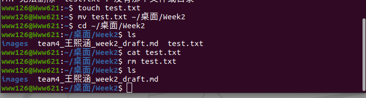  
2.apt安装软件  
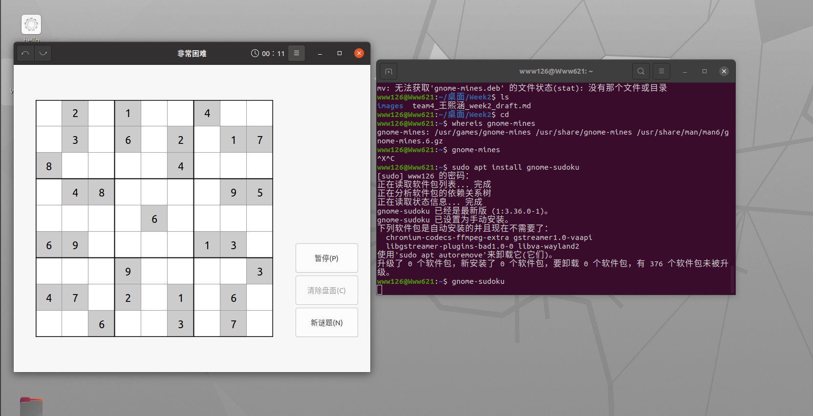  
3.使用ps与kill查看并终止进程  
  
+ **python与c++编程练习**  
1.python hello world  
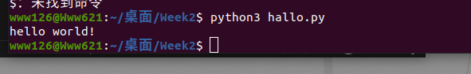  
2.c++简单程序（数字求和）  
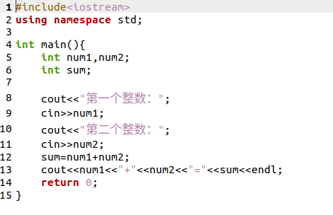  
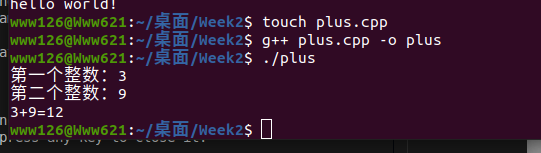  
3.VScode调试  
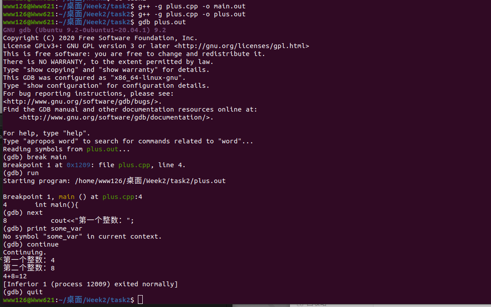  
+ **ROS1安装验证**  
1.配置软件源环境  
2.安装系统对应版本  
3.配置环境变量  
4.启动roscore  
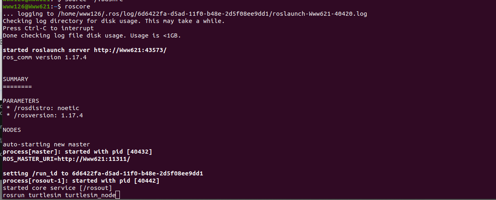  
5.查看rosnode list  
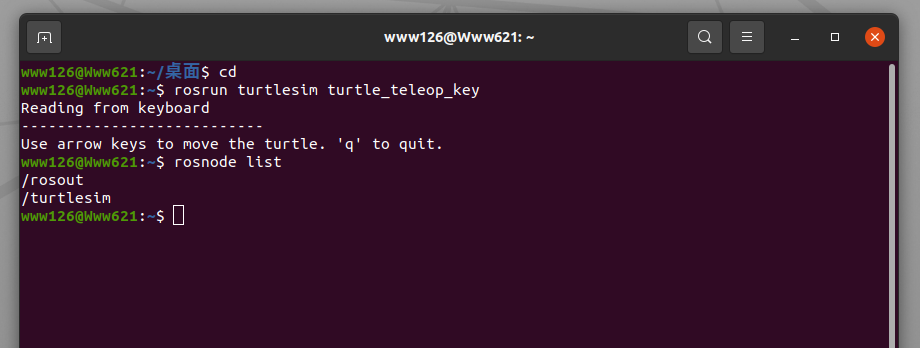  
6.查看ros环境变量  
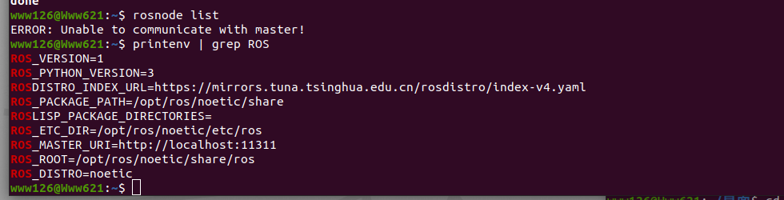  
+ **CATKIN工作空间与功能包**  
1.创建catkin_WS  
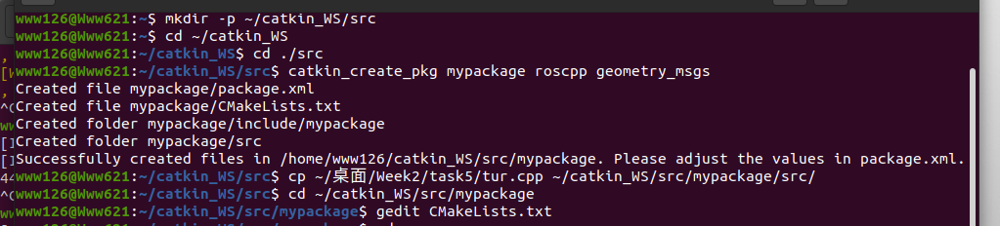  
2.catkin_make编译  
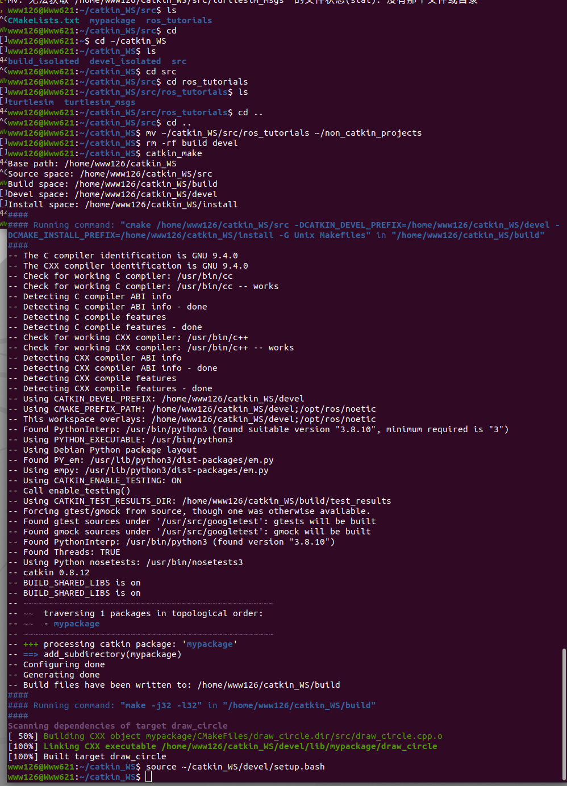  
3.安装beginner_tutorials功能包  
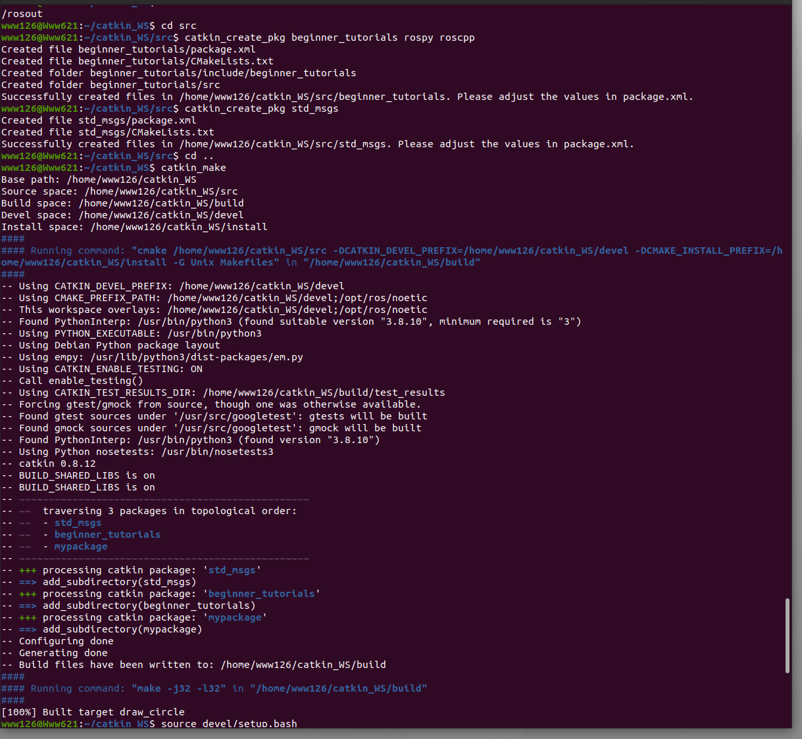  
4.hello world节点运行  
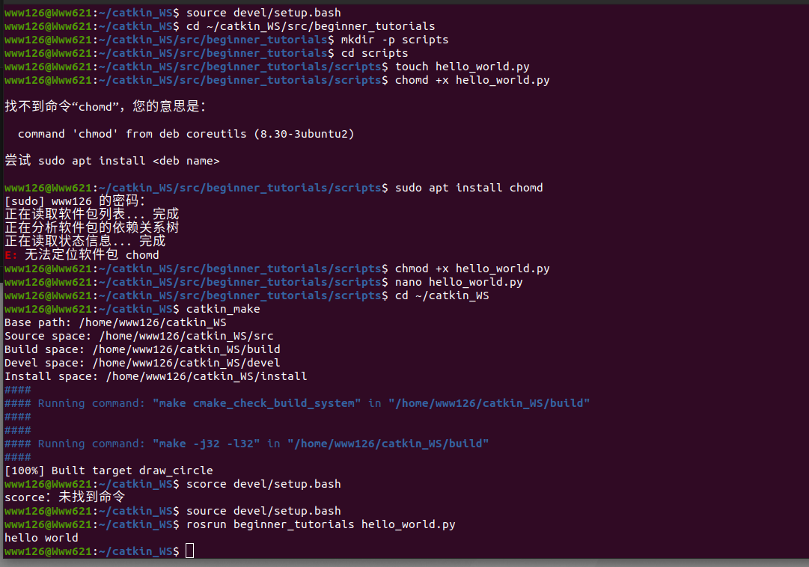  
**turtlesim小乌龟基础**  
1.用键盘控制小乌龟  
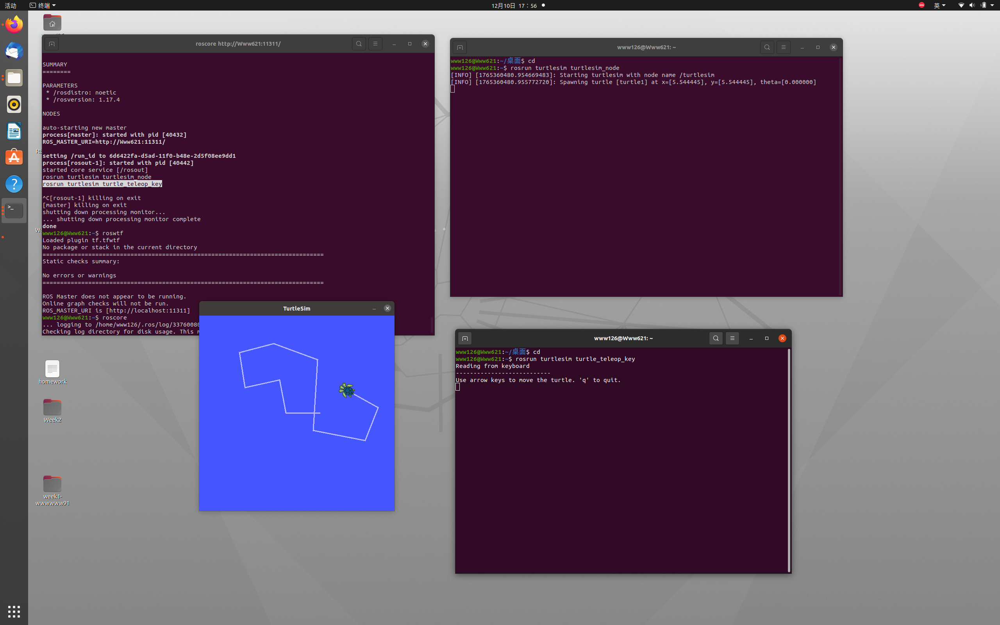  
2.用rostopic控制小乌龟  
  
3.程序控制小乌龟  
  
  
**多乌龟lunch+rqt_graph**  
1.新建launch文件  
2.保存文件到 ROS 功能包的launch目录  
3.编译功能包  
4.启动 launch 文件  
5.使用 rostopic 分别控制乌龟  
6.使用 rqt_graph 绘制通信关系图  
7.使用 rqt_plot 绘制乌龟速度图  
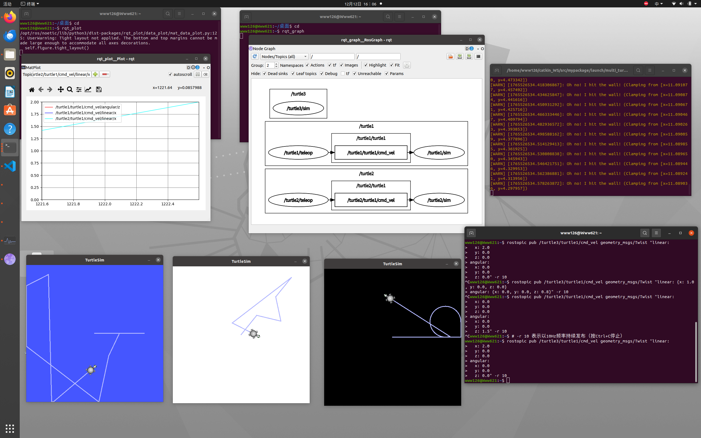  
