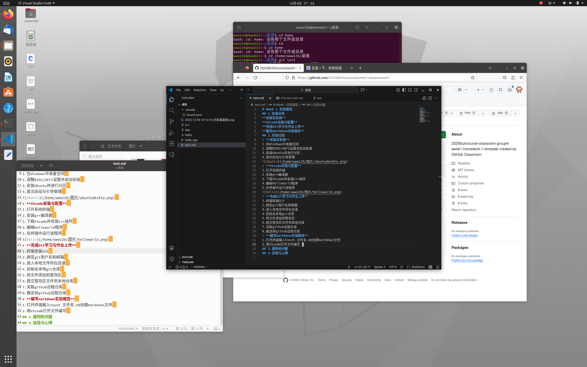

# week1 实验报告 #  
## 一.实验任务 ##  
**1.安装双系统**  
**2.VSCode的安装与配置**  
**3.完成Git学习与作业上传**  
**4.编写markdown实验报告**  
## 二.实验过程 ##  
**1.安装双系统**  
* 前期准备：  
> * 准备一个8GB或更大的U盘  
> * 从Ubuntu官网下载 Ubuntu 20.04.3 LTS桌面版 ISO镜像文件  
> * 使用 Rufus 工具将ISO镜像写入U盘，制作成可启动的安装盘  
* 在Windows中准备空间  
> * 打开Windows“磁盘管理”  
> * 选择一个有足够剩余空间的硬盘分区，右键选择“压缩卷”  
* 调整BIOS/UEFI设置并启动安装  
> * 关闭快速启动：在Windows“电源选项”中，取消勾选“启用快速启动”并保存  
> * 进入BIOS/UEFI：重启电脑，在开机时按F2进入设置界面  
> * 将启动模式设置为 “UEFI Only” ；并将 “Secure Boot”（安全启动）设为“Disabled”  
> * 保存BIOS设置后重启，在启动菜单中选择U盘作为启动设备  
* 安装Ubuntu  
> * 在Ubuntu安装界面，选择语言，然后选择“正常安装”
> * 安装类型：选择 “安装Ubuntu，与Windows Boot Manager共存”
> * 安装完成后重启，拔掉U盘  

  

**2.VSCode的安装与配置**
* 打开系统终端
* 输入“sudo apt install g++ -y”安装g++编译器
* 下载VScode并安装C++插件
* 编辑helloworld程序
* 在终端中运行该程序“g++ helloworld.cpp -o hello”  

**3.完成git学习与作业上传**
* 终端安装Git
* 绑定git用户名和邮箱
* 进入本地文件所在目录
* 初始化本地git仓库
* 将文件添加到暂存区
* 提交暂存区文件到本地仓库
* 关联github远程仓库
* 推送到github远程仓库  

**4.编写markdown实验报告**
* 打开终端输入touch 文件名.md创建markdown文件
* 用VScode打开文件编写  

## 三.遇到的问题与解决办法 ##
**Ubuntu系统网络不稳定，连接超时**  
解决办法：用SSH链接代替HTTPS  

## 四.总结与心得 ##
掌握了Windoows11+Ubuntu双系统的安装部署、Git提交等核心命令及Ubuntu下C++编译运行，初步了解了Ubuntu系统的基础操作，学会了markdown文件的创建与编写，提高了自己对系统的理解和解决技术问题的综合能力